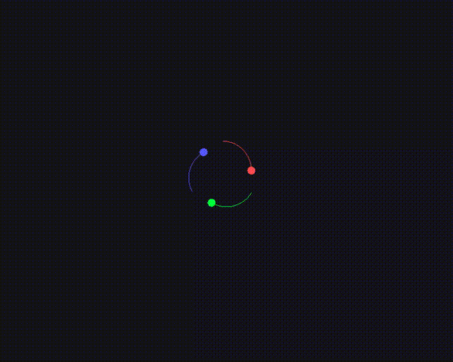

# 3体运动模拟器



一个使用C++20和SFML 3库开发的交互式3体运动模拟程序。

## 功能特点

- **真实引力模拟**: 使用牛顿万有引力定律和Leapfrog积分法计算天体运动
- **交互式配置**:
  - 点击放置天体初始位置
  - 拖动设置天体初始速度和方向
  - 预设稳定的正三角形轨道配置
- **丰富的可视化**:
  - 彩色轨迹显示天体运动路径
  - 实时显示天体速度和质量信息
  - 质心速度和方向指示
- **强大的控制面板**:
  - 暂停/继续模拟
  - 实时编辑天体参数（速度、质量）
  - 重置系统重新配置
- **灵活的视角控制**:
  - 鼠标滚轮缩放视图
  - WASD或方向键平移视图
- **用户友好的界面**:
  - 右侧控制面板实时显示系统状态
  - 可编辑的天体参数字段
  - 质心速度可视化显示

## 系统要求

- C++20或更高版本
- CMake 3.10+
- SFML 3.0库

## 安装SFML

### macOS
```bash
brew install sfml
```

### Ubuntu/Debian
```bash
sudo apt-get install libsfml-dev
```

### 从源码编译
```bash
git clone https://github.com/SFML/SFML.git
cd SFML
mkdir build && cd build
cmake ..
make -j4
sudo make install
```

## 编译和运行

```bash
# 创建构建目录
mkdir build && cd build

# 生成构建文件
cmake ..

# 编译
make

# 运行
./bin/three_body
```

## 使用说明

1. **启动程序**: 程序会自动创建稳定的三体轨道配置
2. **视角控制**:
   - `鼠标滚轮`: 缩放视图
   - `WASD/方向键`: 平移视图
3. **实时编辑**:
   - 点击控制面板中的天体参数字段进行编辑
   - 支持编辑速度(X/Y分量)和质量
   - 按Enter确认，按Escape取消
4. **系统控制**:
   - `Pause/Resume按钮`: 暂停或继续模拟
   - `Reset按钮`: 重置到配置模式
   - `R键`: 快速重置
   - `Escape键`: 退出程序
5. **配置模式**:
   - 重置后可手动放置天体
   - 点击鼠标设置位置，拖动设置速度
   - 按Enter开始模拟

## 物理模型

程序使用软化引力公式和Leapfrog积分法：

```
F = G * m1 * m2 / (r² + ε²)
```

其中：
- G = 8000.0 (引力常数)
- ε = 30.0 (软化参数)
- 时间步长 = 0.002秒
- 每帧物理计算次数 = 15次

## 项目结构

```
.
├── body.hh/cc              # 天体类（位置、速度、轨迹）
├── three_body_system.hh/cc # 主模拟系统
├── constants.hh            # 物理常数和配置参数
├── main.cc                 # 程序入口
└── CMakeLists.txt          # 构建配置
```

## 技术细节

- 使用Leapfrog积分法保证数值稳定性
- 60 FPS刷新率保证流畅的视觉效果
- 实时计算N-体引力相互作用
- 质心速度修正防止系统漂移
- 支持轨迹显示（最大5000点）
- 字体缓存优化性能

## 自定义配置

编辑 `constants.hh` 可以修改：
- 引力常数和物理参数
- 时间步长和积分精度
- 天体颜色和默认属性
- 窗口大小和布局

## 故障排除

如果遇到编译错误：

1. 检查SFML是否正确安装：`find /usr -name "libsfml-*"`
2. 确保CMake能找到SFML：检查CMakeLists.txt中的路径
3. 如果在macOS上字体加载失败，可能需要调整字体路径

## 许可证

MIT License