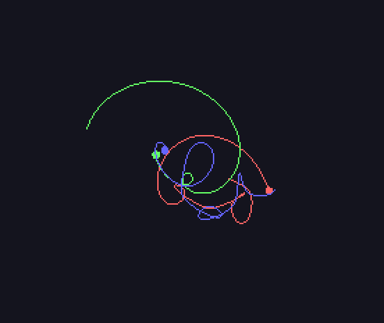

# 3体运动模拟器



一个使用C++20和SFML 3库开发的交互式3体运动模拟程序。

## 功能特点

- **真实引力模拟**: 使用牛顿万有引力定律计算3个天体之间的相互作用
- **鼠标交互配置**: 
  - 点击鼠标放置天体初始位置
  - 拖动鼠标设置天体初始速度和方向
- **实时可视化**: 显示天体运动轨迹和速度向量
- **交互控制**: 
  - 按R重置系统
  - 按V显示速度向量
  - 按ESC退出程序

## 系统要求

- C++11或更高版本
- CMake 3.10+
- SFML 3.x库

## 安装SFML

### macOS
```bash
brew install sfml
```

### Ubuntu/Debian
```bash
sudo apt-get install libsfml-dev
```

### 从源码编译
```bash
git clone https://github.com/SFML/SFML.git
cd SFML
mkdir build && cd build
cmake ..
make -j4
sudo make install
```

## 编译和运行

```bash
# 创建构建目录
mkdir build && cd build

# 生成构建文件
cmake ..

# 编译
make

# 运行
./bin/three_body
```

## 使用说明

1. **放置天体**: 在窗口中点击3次鼠标左键，放置3个天体
2. **设置速度**: 放置完3个天体后，拖动鼠标设置每个天体的初始速度
3. **开始模拟**: 配置完成后，程序自动开始模拟
4. **实时控制**:
   - 按 `R` 重置到配置模式
   - 按 `V` 显示速度向量
   - 按 `ESC` 退出程序

## 物理模型

程序使用软化引力公式避免数值不稳定：

```
F = G * m1 * m2 / (r² + ε²)
```

其中：
- G = 1000 (引力常数)
- ε = 5.0 (软化参数)
- 时间步长 = 0.016秒

## 技术细节

- 使用半隐式欧拉积分法更新位置和速度
- 60 FPS刷新率保证流畅的视觉效果
- 实时计算N-体引力相互作用（N=3）

## 故障排除

如果遇到编译错误：

1. 检查SFML是否正确安装：`find /usr -name "libsfml-*"`
2. 确保CMake能找到SFML：检查CMakeLists.txt中的路径
3. 如果在macOS上字体加载失败，可能需要调整字体路径

## 许可证

MIT License